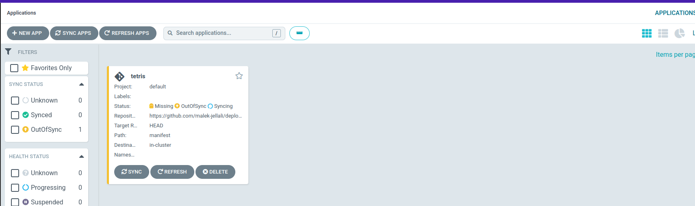
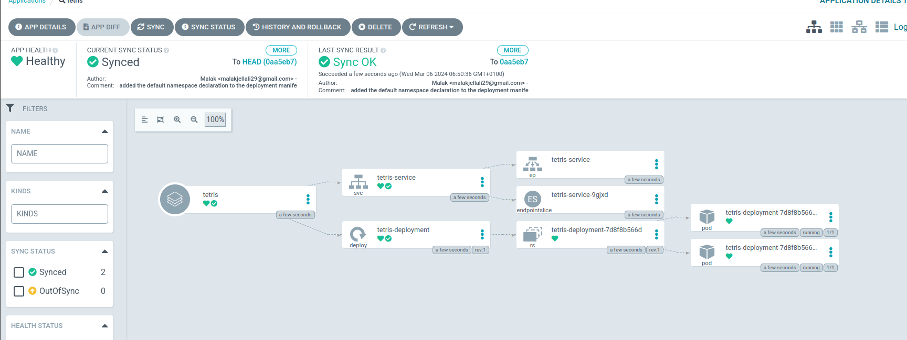
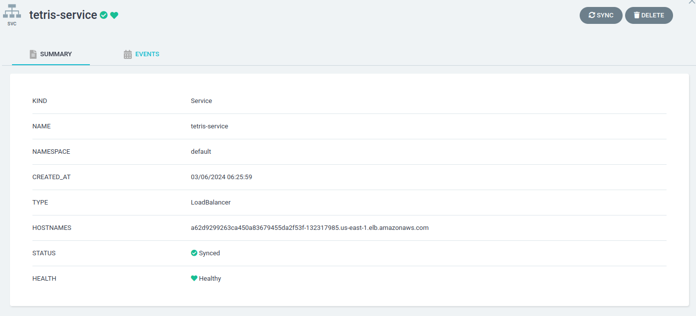
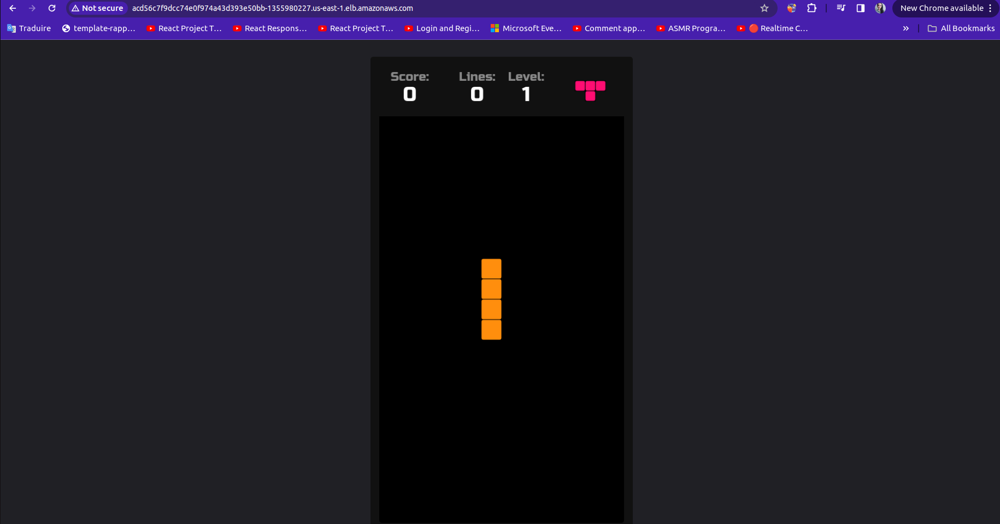

# 🎮 Deploy Tetris Game using ArgoCD and EKS Cluster 🚀

## Introduction
This project demonstrates the deployment of a Tetris game application using ArgoCD on an Amazon EKS cluster. GitOps principles are leveraged to streamline the deployment process, utilizing Git repositories as a single source of truth for managing applications and infrastructure.

## Step-by-Step Guide
### 1. Create EKS Cluster and Worker Nodes
- Create an Amazon EKS cluster.
- Provision two worker nodes for the EKS cluster.
- Configure the terminal to use this EKS cluster.

### 2. Configure ArgoCD on EKS Cluster
Follow the steps outlined in the AWS EKS Intermediate Workshop to configure ArgoCD on the EKS cluster:
- [AWS EKS Intermediate Workshop - ArgoCD Installation](https://archive.eksworkshop.com/intermediate/290_argocd/install/)
- Access the ArgoCD container using the ArgoCD load balancer DNS.
- Manage a repository:
  - Navigate to **Manage your repositories**.
  - Connect the repository using HTTPS.
  - Enter the repository URL (you can use a provided or your own public repository).
  - Leave other configurations as default and press **Connect**.
- Create an application in ArgoCD:
  - Name: Tetris
  - Project Name: Default
  - Repository URL: Git repository URL (you can use a provided or your own public repository).
  - Path: Path to the manifests file (e.g., manifest)
  - Cluster URL: Default EKS cluster URL
  - Leave all other parameters as default and press **Create**.

### 3. Accessing the Application
- Once the application is deployed, use the "hostnames" of the service created to access the application from the service created with argoCD.
  
  
- Access the load balancer's URL to view the Tetris game application running on the EKS cluster.
  

### 4. Troubleshooting
If unable to access the application, correct this by editing the inbound rules of the security group associated with the load balancer. Follow the provided instructions for reference.

## Challenges Faced
During the deployment process, challenges were encountered in configuring AWS services, managing Kubernetes resources, and integrating ArgoCD with the EKS cluster. These challenges were overcome by referring to documentation and seeking assistance from community forums.

## Key Takeaways

### GitOps Approach
- ⭐️ **Git Repositories as Single Point of Truth:** GitOps employs Git repositories as a central source of truth to deploy applications and manage infrastructure configurations.
- ⭐️ **Automated Deployment:** GitOps automates the deployment of manifest files and other resources, reducing manual intervention and ensuring consistency across environments.

### Challenges with Manual Deployment
Deploying files manually poses various challenges:
- ⭐️ Increased Risk
- ⭐️ Slower Deployment Time
- ⭐️ Difficulty in Rollback

### Leveraging GitOps Tools
Using GitOps tools such as ArgoCD mitigates these challenges:
- ⭐️ **Automated Synchronization:** ArgoCD utilizes the Git repository as a single source of truth. It automatically detects changes made to the repository and synchronizes resources accordingly.

### Benefits of GitOps
GitOps offers numerous benefits, including:
1. ⭐️ **Automation:** Minimizes human error by automating deployment processes.
2. ⭐️ **Version Control:** Provides versioning capabilities, enabling rollback to previous configurations if needed.
3. ⭐️ **Consistency:** Ensures consistency across environments by enforcing configuration management through Git repositories.
4. ⭐️ **Security:** Enables access control to Git repositories, enhancing security measures.
5. ⭐️ **Faster Deployment:** Accelerates the time of deployment by automating repetitive tasks and streamlining workflows.
